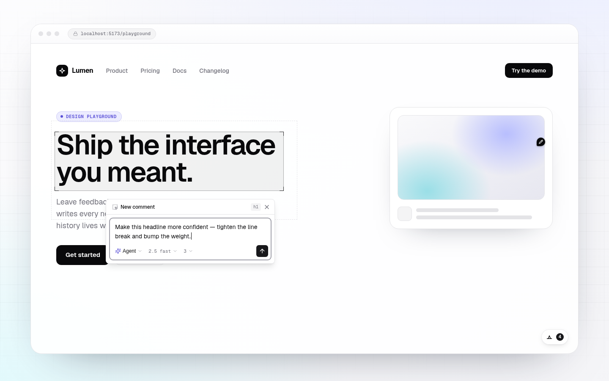

# design-crit

Dev-only comments for **Vite + React design playgrounds**. Click an element,
leave feedback, and optionally let an agent generate source-backed iterations.

Design Crit stores feedback in your repo: comment markers live in `.tsx` files and
iteration snapshots live under `designs/`.

> 0.x scope: React 19 and Vite 8. APIs may change before 1.0.

## Screenshots




## Install

```sh
pnpm add -D design-crit
# or: npm install --save-dev design-crit
```

Peer dependencies: `react`, `react-dom`, `vite`.

Requirements: Node 20 or newer. The development commands in this repository use
pnpm.

## Quick Start

Add the Vite plugin:

```ts
// vite.config.ts
import react from "@vitejs/plugin-react";
import { defineConfig } from "vite";
import { designCrit } from "design-crit/plugin";

export default defineConfig({
  plugins: [designCrit(), react()],
});
```

That is the only setup for the default path. `designCrit()` runs in dev only,
stamps JSX source locations, installs the comment/iteration API, imports the
compiled overlay CSS, and mounts the overlay. Your app does not need to scan
design-crit with Tailwind.

## Using Design Crit

Open your app in dev, click the design-crit button, then click an element to leave a
comment. New comments are written as JSX markers:

```tsx
<button data-comment-anchor="550e8400-e29b-41d4-a716-446655440000">
  Save
</button>
{/* @comment id="550e8400-e29b-41d4-a716-446655440000" anchor="550e8400-e29b-41d4-a716-446655440000" text="Too heavy" author="you@example.com" date="2026-05-26T12:00:00.000Z" */}
```

Screenshots and agent iterations are written under `designs/`. Add `designs/`
and `public/designs/` to the host app's `.gitignore` if those artifacts should
stay local.

## Example

Try the minimal Vite app in [`examples/basic-vite`](./examples/basic-vite):

```sh
pnpm install
pnpm build
pnpm example
```

That app is only the default `designCrit()` plugin plus a small React surface. It
does not manually import the overlay or use Tailwind. Comment markers are
written into `examples/basic-vite/src/`; local iteration artifacts land under
`examples/basic-vite/designs/`.

## AI Iteration

Agent mode uses your configured local tools:

- Cursor CLI (`agent`): run `agent login` or set `CURSOR_API_KEY`.
- Claude: set `ANTHROPIC_API_KEY` or use Claude Code login.
- Optional: set `CURSOR_AGENT_PATH` when the Cursor CLI binary is not named
  `agent`.

Copy `.env.example` if you want to document local agent credentials for a host
app. Design Crit does not send keys to the browser; local agent tools read their own
credentials.

Default model order:

```txt
composer-2.5-fast -> composer-2.5 -> claude-sonnet-4-6 -> default
```

Override it in `vite.config.ts`:

```ts
designCrit({
  agentModelPriority: ["composer-2.5-fast", "claude-sonnet-4-6", "default"],
  agentSkills: ["frontend-design"], // pass [] to disable skill guidance
});
```

## Options

```ts
designCrit({
  allowRemoteAccess: false,
  excludeSrcPrefixes: ["src/dev/"],
  cursorAgentPath: "/usr/local/bin/agent",
  agentModelPriority: ["composer-2.5-fast", "composer-2.5", "default"],
  agentSkills: ["frontend-design"],
});
```

If you want to mount the overlay yourself, use the lower-level plugins:

```ts
// vite.config.ts
import react from "@vitejs/plugin-react";
import { defineConfig } from "vite";
import { comments, sourceLoc } from "design-crit/plugin";

export default defineConfig({
  plugins: [sourceLoc(), react(), comments()],
});
```

```tsx
import { CommentOverlay } from "design-crit";
import "design-crit/styles.css";

export function App() {
  return (
    <>
      <YourPlayground />
      {import.meta.env.DEV && <CommentOverlay />}
    </>
  );
}
```

## Safety

Design Crit is a local development tool. Its Vite middleware can read and write app
source files, write screenshots and iteration artifacts, and run configured AI
agents. Do not expose a Vite dev server running design-crit to an untrusted network
or run it with `vite --host` unless the network is trusted.

The API rejects non-loopback clients by default. Pass `allowRemoteAccess: true`
only when the dev server is intentionally reachable from a trusted network.

When AI iteration is enabled, selected source context, comments, screenshots,
and feedback may be sent to your configured provider. See [`SECURITY.md`](./SECURITY.md).

## Public API

| Import | Exports |
| --- | --- |
| `design-crit` | `CommentOverlay` and public types |
| `design-crit/plugin` | `designCrit()`, `comments()`, `sourceLoc()` |
| `design-crit/styles.css` | Compiled overlay CSS |

## Development

Architecture notes live in [`docs/architecture.md`](./docs/architecture.md).
`AGENTS.md` is guidance for AI coding assistants; human contributors should
start with [`CONTRIBUTING.md`](./CONTRIBUTING.md).
For a manual smoke check in a real Vite dev server, use `pnpm example`.

```sh
pnpm install
pnpm check
pnpm typecheck
pnpm test
pnpm build
```

## License

MIT
