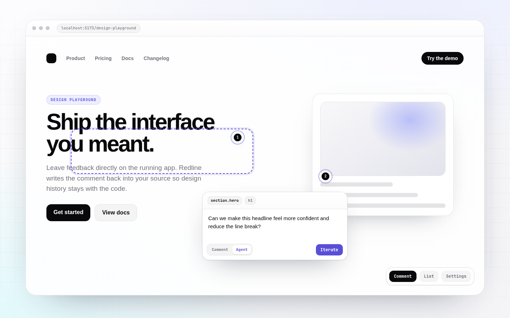

# redline

Dev-only comments for **Vite + React design playgrounds**. Click an element,
leave feedback, and optionally let an agent generate source-backed iterations.

Redline stores feedback in your repo: comment markers live in `.tsx` files and
iteration snapshots live under `designs/`.

> 0.x scope: React 19, Vite 8, and React Router 7. APIs may change before 1.0.

## Screenshots




## Install

```sh
pnpm add -D redline
# or: npm install --save-dev redline
```

Before npm publish:

```sh
pnpm add -D github:PauliusKrutkis/redline
```

Peer dependencies: `react`, `react-dom`, `react-router-dom`, `vite`.

## Quick Start

Add the Vite plugin:

```ts
// vite.config.ts
import react from "@vitejs/plugin-react";
import { defineConfig } from "vite";
import { redline } from "redline/plugin";

export default defineConfig({
  plugins: [redline(), react()],
});
```

That is the only setup for the default path. `redline()` runs in dev only,
stamps JSX source locations, installs the comment/iteration API, imports the
compiled overlay CSS, and mounts the overlay. Your app does not need to scan
redline with Tailwind.

## Using Redline

Open your app in dev, click the redline button, then click an element to leave a
comment. New comments are written as JSX markers:

```tsx
<button data-comment-anchor="550e8400-e29b-41d4-a716-446655440000">
  Save
</button>
{/* @comment id="550e8400-e29b-41d4-a716-446655440000" anchor="550e8400-e29b-41d4-a716-446655440000" text="Too heavy" author="you@example.com" date="2026-05-26T12:00:00.000Z" */}
```

Screenshots and agent iterations are written under `designs/`. Add `designs/`
and `public/designs/` to the host app's `.gitignore` if those artifacts should
stay local.

## AI Iteration

Agent mode uses your configured local tools:

- Cursor CLI (`agent`): run `agent login` or set `CURSOR_API_KEY`.
- Claude: set `ANTHROPIC_API_KEY` or use Claude Code login.

Default model order:

```txt
composer-2.5-fast -> composer-2.5 -> claude-sonnet-4-6 -> default
```

Override it in `vite.config.ts`:

```ts
redline({
  agentModelPriority: ["composer-2.5-fast", "claude-sonnet-4-6", "default"],
  agentSkills: ["frontend-design"], // pass [] to disable skill guidance
});
```

## Options

```ts
redline({
  excludeSrcPrefixes: ["src/dev/"],
  cursorAgentPath: "/usr/local/bin/agent",
  agentModelPriority: ["composer-2.5-fast", "composer-2.5", "default"],
  agentSkills: ["frontend-design"],
});
```

If you want to mount the overlay yourself, use the lower-level plugins:

```ts
// vite.config.ts
import react from "@vitejs/plugin-react";
import { defineConfig } from "vite";
import { comments, sourceLoc } from "redline/plugin";

export default defineConfig({
  plugins: [sourceLoc(), react(), comments()],
});
```

```tsx
import { CommentOverlay } from "redline";
import "redline/styles.css";

export function App() {
  return (
    <>
      <YourPlayground />
      {import.meta.env.DEV && <CommentOverlay />}
    </>
  );
}
```

## Safety

Redline is a local development tool. Its Vite middleware can read and write app
source files, write screenshots and iteration artifacts, and run configured AI
agents. Do not expose a Vite dev server running redline to an untrusted network.

When AI iteration is enabled, selected source context, comments, screenshots,
and feedback may be sent to your configured provider. See [`SECURITY.md`](./SECURITY.md).

## Public API

| Import | Exports |
| --- | --- |
| `redline` | `CommentOverlay` and public types |
| `redline/plugin` | `redline()`, `comments()`, `sourceLoc()` |
| `redline/styles.css` | Compiled overlay CSS |

## Development

```sh
pnpm install
pnpm check
pnpm typecheck
pnpm test
pnpm build
```

## License

MIT
