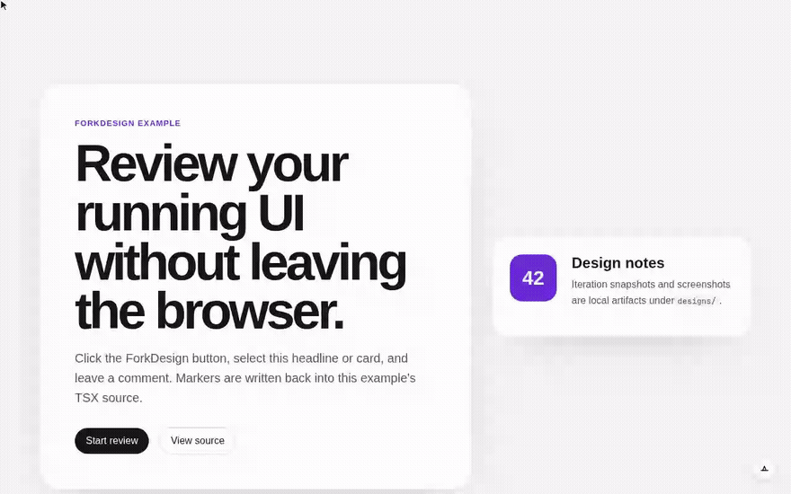
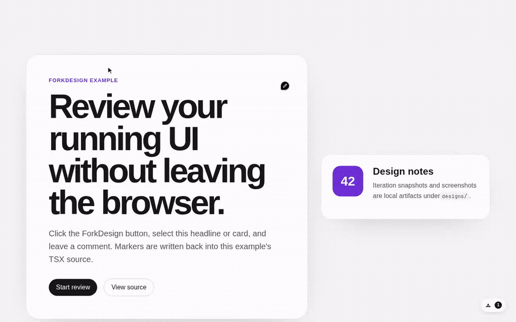

# Fork Design

[](https://www.npmjs.com/package/@pako_krc/forkdesign)

**Local-first AI design iteration for React devs.** Comment on any component,
get source-backed variants, and keep the whole history in your repo — no SaaS,
every change is a `git diff`.



> Comments and variants live in your repo as JSX markers + on-disk snapshots you
> commit, `git diff`, and `git checkout` — not in a vendor database.
>
> 0.x scope: React 19 and Vite 8. APIs may change before 1.0.

## 30-second tour

1. **Add the plugin** — one line in `vite.config.ts` (`forkDesign()`), dev-only.
2. **Click the Fork Design pill,** then click any element in your running app.
3. **Leave a comment** — it is written straight back into your `.tsx`, beside the
   element, as a marker you can review like any other change:

   ```diff
   -<h1>Review your running UI without leaving the browser.</h1>
   +<h1 data-comment-anchor="32aae123-…">Review your running UI without leaving the browser.</h1>
   +{/* @comment id="f3e9…" text="Tighten this headline — two lines max, and bump the contrast." author="dev@local" … */}
   ```

4. **Or switch to Agent mode** and let your local agent generate source-backed
  variants; flip between versions and keep the one you like.
5. **Review it like code** — `git diff` to see exactly what changed, `git
  checkout` to revert. Nothing leaves your machine except what your own agent sends.

## Is this for you?

**Yes, if:**

- You build UIs with **React + Vite** and want to iterate on design in the
running app, against real components.
- You want feedback and variants to live **in your repo** — JSX markers and
on-disk snapshots you commit, `git diff`, and `git checkout` — not in a vendor
database.
- You're fine with a dev-only tool that edits your source, *because* every edit
is a reviewable, revertable diff.
- You want one focused workflow, not a platform.

**No, if:**

- You need a hosted space for **non-technical stakeholders** to leave feedback.
Fork Design runs on a developer's dev server; it is not a SaaS and there is no
hosted mode.
- You're **not on React + Vite**. There is no other framework support (0.x
targets React 19 and Vite 8).
- You want an **app generator** that builds whole pages or products from a
prompt. Fork Design iterates on components you already have — it is not v0 or
Lovable.

## How it compares

Fork Design is deliberately narrow. It is not a generator and not a design
platform — it is local-first design iteration that keeps its history in your
git.


|                   | **Fork Design**                                      | v0 / Lovable                      | Onlook                    |
| ----------------- | --------------------------------------------------- | --------------------------------- | ------------------------- |
| Where it runs     | Your local Vite dev server                          | Hosted SaaS                       | Local app on your project |
| Where state lives | **Your git repo** (JSX markers + on-disk snapshots) | Vendor cloud                      | Your source files         |
| Primary job       | Iterate on existing components                      | Generate apps/pages from a prompt | Visual editing            |
| AI                | Your local agent (Cursor / Claude), your keys       | Provider-hosted                   | Provider-hosted           |
| Frameworks        | React + Vite only                                   | Flexible / Next.js-first          | React                     |
| Each change is    | A git diff you review and revert                    | Cloud state you export            | Edits to source           |


**Where Fork Design wins:** local-first (no vendor database, no account), every
change is a reviewable diff in your repo, and it does one workflow well.

**Where it doesn't:** it won't generate an app from scratch, it's React + Vite
only, and it's built for a single developer's local loop — there's no built-in
team/collaboration layer.

## Install

```sh
pnpm add -D @pako_krc/forkdesign
# or: npm install --save-dev @pako_krc/forkdesign
```

Peer dependencies: `react`, `react-dom`, `vite`.

Requirements: Node 20 or newer. The development commands in this repository use
pnpm.

## Quick Start

Add the Vite plugin:

```ts
// vite.config.ts
import react from "@vitejs/plugin-react";
import { defineConfig } from "vite";
import { forkDesign } from "@pako_krc/forkdesign/plugin";

export default defineConfig({
  plugins: [forkDesign(), react()],
});
```

That is the only setup for the default path. `forkDesign()` runs in dev only,
stamps JSX source locations, installs the comment/iteration API, imports the
compiled overlay CSS, and mounts the overlay. Your app does not need to scan
Fork Design with Tailwind.

## Using Fork Design

Open your app in dev, click the Fork Design button, then click an element to leave a
comment. New comments are written as JSX markers:

```tsx
<button data-comment-anchor="550e8400-e29b-41d4-a716-446655440000">
  Save
</button>
{/* @comment id="550e8400-e29b-41d4-a716-446655440000" anchor="550e8400-e29b-41d4-a716-446655440000" text="Too heavy" author="you@example.com" date="2026-05-26T12:00:00.000Z" */}
```

Screenshots and agent iterations are written under `designs/`. Add `designs/`
and `public/designs/` to the host app's `.gitignore` if those artifacts should
stay local.

## Try it in 30 seconds

Scaffold a ready-to-run Vite + React app with Fork Design already wired in — no
clone, no plugin config:

```sh
npx degit PauliusKrutkis/forkdesign/examples/starter my-forkdesign-app
cd my-forkdesign-app
npm install
npm run dev
```

Open the printed URL, click the Fork Design pill, then select an element to leave
a comment — the marker is written straight into your source. Configure a local
agent (see [AI Iteration](#ai-iteration)) to generate source-backed variants.

## Example

Try the minimal Vite app in [`examples/basic-vite`](./examples/basic-vite):

```sh
pnpm install
pnpm build
pnpm example
```

That app is only the default `forkDesign()` plugin plus a small React surface. It
does not manually import the overlay or use Tailwind. Comment markers are
written into `examples/basic-vite/src/`; local iteration artifacts land under
`examples/basic-vite/designs/`.

## AI Iteration



> Each variant is a real on-disk redesign of the commented component. Click a
> card to make it live in the running app; the winner is written back to your
> source, the rest stay as a `git diff` you can keep or drop.

Agent mode uses your configured local tools:

- Cursor CLI (`agent`): run `agent login` or set `CURSOR_API_KEY`.
- Claude: set `ANTHROPIC_API_KEY` or use Claude Code login.
- Optional: set `CURSOR_AGENT_PATH` when the Cursor CLI binary is not named
`agent`.

Copy `.env.example` if you want to document local agent credentials for a host
app. Fork Design does not send keys to the browser; local agent tools read their own
credentials.

Default model order:

```txt
composer-2.5-fast -> composer-2.5 -> claude-sonnet-4-6 -> default
```

Override it in `vite.config.ts`:

```ts
forkDesign({
  agentModelPriority: ["composer-2.5-fast", "claude-sonnet-4-6", "default"],
  agentSkills: ["frontend-design"], // pass [] to disable skill guidance
});
```

## Options

```ts
forkDesign({
  allowRemoteAccess: false,
  excludeSrcPrefixes: ["src/dev/"],
  cursorAgentPath: "/usr/local/bin/agent",
  agentModelPriority: ["composer-2.5-fast", "composer-2.5", "default"],
  agentSkills: ["frontend-design"],
});
```

If you want to mount the overlay yourself, use the lower-level plugins:

```ts
// vite.config.ts
import react from "@vitejs/plugin-react";
import { defineConfig } from "vite";
import { comments, sourceLoc } from "@pako_krc/forkdesign/plugin";

export default defineConfig({
  plugins: [sourceLoc(), react(), comments()],
});
```

```tsx
import { CommentOverlay } from "@pako_krc/forkdesign";
import "@pako_krc/forkdesign/styles.css";

export function App() {
  return (
    <>
      <YourPlayground />
      {import.meta.env.DEV && <CommentOverlay />}
    </>
  );
}
```

## Safety

Fork Design is a local development tool. Its Vite middleware can read and write app
source files, write screenshots and iteration artifacts, and run configured AI
agents. Do not expose a Vite dev server running Fork Design to an untrusted network
or run it with `vite --host` unless the network is trusted.

The API rejects non-loopback clients by default. Pass `allowRemoteAccess: true`
only when the dev server is intentionally reachable from a trusted network.

When AI iteration is enabled, selected source context, comments, screenshots,
and feedback may be sent to your configured provider. See [`SECURITY.md`](./SECURITY.md).

## Public API


| Import                             | Exports                                     |
| ---------------------------------- | ------------------------------------------- |
| `@pako_krc/forkdesign`             | `CommentOverlay` and public types           |
| `@pako_krc/forkdesign/plugin`      | `forkDesign()`, `comments()`, `sourceLoc()` |
| `@pako_krc/forkdesign/styles.css`  | Compiled overlay CSS                        |


## Development

Architecture notes live in [`docs/architecture.md`](./docs/architecture.md).
`AGENTS.md` is guidance for AI coding assistants; human contributors should
start with [`CONTRIBUTING.md`](./CONTRIBUTING.md).
For a manual smoke check in a real Vite dev server, use `pnpm example`.

```sh
pnpm install
pnpm check
pnpm typecheck
pnpm test
pnpm build
```

## License

MIT