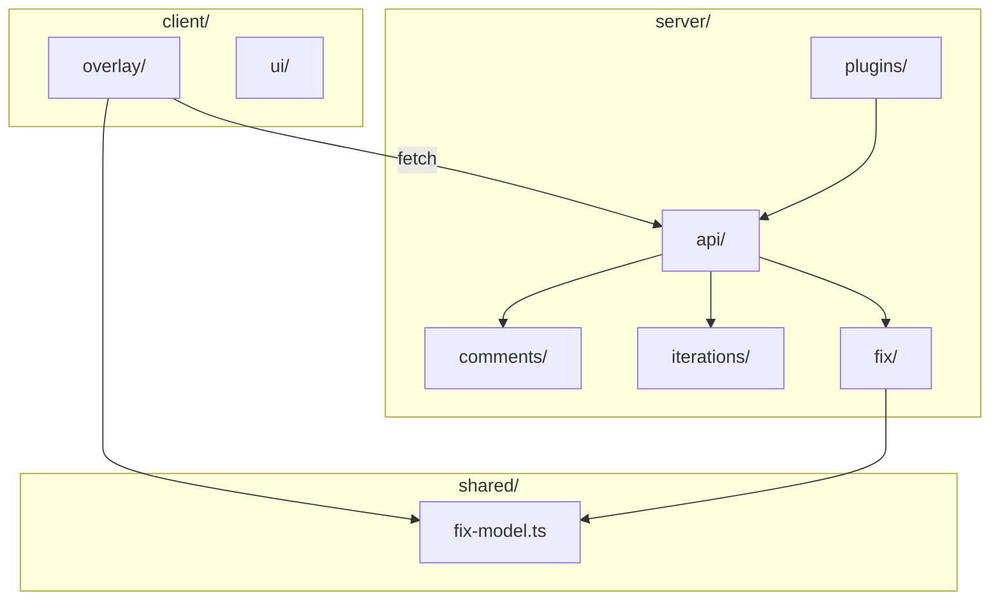

# Architecture & folder layout

Guidance for organizing the redline codebase: predictable paths, clear runtime boundaries, and scanability for humans and AI agents.

## Runtime boundaries

Redline ships two public entry points (see `package.json` exports):

| Entry | Import | Runtime | Role |
|-------|--------|---------|------|
| Client | `redline` | Browser | React overlay UI |
| Server | `redline/plugin` | Node (Vite dev) | Vite plugins + dev API middleware |

**Critical constraint:** the browser module graph must never import Node builtins, `recast`, or `@babel/*`. The split in `src/index.ts` vs `src/plugin/index.ts` exists for this reason. Folder layout should make the boundary obvious at a glance.

## Current layout (problems)

```
src/
├── index.ts, plugin/index.ts     # public entries
├── plugin.ts                     # ~1950 lines — monolith
├── babel-comment-reader.ts       # root sprawl
├── babel-comment-writer.ts
├── source-loc-plugin.ts
├── iterations-manifest.ts
├── components/                   # UI + hooks + utils + types (flat)
├── fix/                          # ✓ well-structured domain module
└── lib/utils.ts
```

| Issue | Impact |
|-------|--------|
| `plugin.ts` monolith | Hard to scan; mixes HTTP handlers, parsing, path safety, I/O |
| Flat `components/` | UI, hooks, geometry, settings, types share one directory |
| `plugin.ts` vs `plugin/index.ts` | Confusing: real code at root, entry in subfolder |
| Root-level server files | No grouping by domain |
| `components/settings.ts` → `fix/models.ts` | Client imports server-side fix module (boundary leak) |

**Reference:** `src/fix/` is the template to replicate — types, config, strategies, colocated tests, single public surface via `fix/index.ts`.

## Design principle: domain modules, not generic buckets

Avoid a top-level tree like `models/`, `services/`, `tests/` for the whole repo. At ~80 files, generic folders hide intent (“Is `iterations-manifest` a model or a service?”).

**Rule:** folder name = bounded context / feature. Inside each domain, use predictable subfolders by kind (`hooks/`, `lib/`, `ui/`, `strategies/`, etc.).

## Target structure

```text
src/
├── index.ts                      # client public entry
├── plugin/
│   └── index.ts                  # server public entry
│
├── client/                       # browser-only
│   ├── overlay/                  # comment overlay feature
│   │   ├── *.tsx                 # CommentOverlay, CommentBubble, …
│   │   ├── hooks/
│   │   │   ├── useAnchorElement.ts
│   │   │   └── useIterations.ts
│   │   └── lib/                  # overlay-specific non-React helpers
│   │       ├── placement.ts
│   │       ├── sourceLoc.ts
│   │       └── screenshot.ts
│   ├── settings.ts
│   ├── types.ts
│   └── ui/                       # shadcn-style primitives
│
├── server/                       # node-only
│   ├── plugins/
│   │   ├── comments.ts           # thin `comments()` factory
│   │   └── source-loc.ts
│   ├── api/
│   │   ├── comments/
│   │   │   ├── routes.ts
│   │   │   └── parse-body.ts
│   │   └── iterations/
│   │       ├── routes.ts
│   │       └── parse-body.ts
│   ├── comments/                 # AST read/write
│   │   ├── reader.ts
│   │   ├── writer.ts
│   │   └── find-comment.ts
│   ├── iterations/
│   │   └── manifest.ts
│   ├── fix/                      # existing module (move here)
│   └── lib/                      # shared server utilities
│       ├── path-safety.ts
│       ├── http.ts
│       └── atomic-write.ts
│
├── shared/                       # safe for client AND server
│   └── fix-model.ts              # FixModel type + VALID_FIX_MODELS
│
├── lib/
│   └── utils.ts                  # cn() — client UI helper
└── styles.css
```

### Path → meaning

| Path prefix | Meaning |
|-------------|---------|
| `client/` | Browser code only |
| `server/` | Node / Vite plugin code only |
| `shared/` | Types/constants with no Node or React deps |
| `*/hooks/` | React hooks |
| `*/lib/` | Pure helpers (no components) |
| `*/ui/` | Presentational primitives |
| `server/api/` | HTTP middleware handlers |
| `server/fix/strategies/` | AI fix backends |

### Where “models / services / tests” go

| Concept | Location |
|---------|----------|
| Models (types) | Per domain: `client/types.ts`, `server/fix/types.ts`, `shared/fix-model.ts` |
| Services | Server domain modules: `server/comments/`, `server/iterations/`, `server/fix/` |
| UI | `client/ui/` and `client/overlay/*.tsx` |
| Tests | Colocated `*.test.ts` next to implementation (same as `fix/` today) |

## Migration plan (incremental)

Do not big-bang. Public exports (`redline`, `redline/plugin`) stay stable; restructure internals only.

### Phase 1 — Split the monolith (highest ROI)

Extract from `plugin.ts` into:

- `server/api/comments/` — GET/POST/PATCH/DELETE handlers
- `server/api/iterations/` — list, activate, new, screenshot
- `server/lib/` — `readJsonBody`, `sendError`, atomic writes, path safety
- `server/comments/find-comment.ts` — `findCommentById`, `collectAllowedTsxFiles`

Leave `server/plugins/comments.ts` as thin wiring (~100 lines).

### Phase 2 — Group root-level server files

| From | To |
|------|-----|
| `babel-comment-reader.ts` | `server/comments/reader.ts` |
| `babel-comment-writer.ts` | `server/comments/writer.ts` |
| `iterations-manifest.ts` | `server/iterations/manifest.ts` |
| `source-loc-plugin.ts` | `server/plugins/source-loc.ts` |

### Phase 3 — Restructure client

Move `components/*` → `client/overlay/` (+ `hooks/`, `lib/` subfolders). Update `src/index.ts` re-exports only.

### Phase 4 — Fix boundary leaks

Move `FixModel` and `VALID_FIX_MODELS` to `shared/fix-model.ts`. Client `settings.ts` imports from `shared/`, not `server/fix/`.

### Phase 5 — Document & enforce

- Keep this doc updated as phases land
- Optional: `tsconfig` path aliases (`@client/*`, `@server/*`, `@shared/*`)

## Conventions

### Naming

- React components: `PascalCase.tsx`
- Hooks: `use*.ts` in `hooks/`
- Pure helpers: `camelCase.ts` in `lib/`
- Prefer consistent casing (e.g. align `comment-thumb.tsx` with `CommentBubble.tsx`)

### File size

Target ~300 lines max per file. Current outliers: `plugin.ts`, `babel-comment-writer.ts`.

### Public vs internal

- **Public API:** `src/index.ts`, `src/plugin/index.ts` only
- Domain folders may use a local `index.ts` for internal grouping; avoid deep barrel re-export chains

### Tests

One convention: colocated `*.test.ts` beside source (matches `fix/` and most of the repo).

## What not to do

- **Pure type-based top-level tree** (`models/`, `services/`, `controllers/`) — wrong fit for a library this size
- **Central `tests/` mirror** — doubles maintenance; harder to discover impl + spec together
- **Rename package exports** — keep `redline` and `redline/plugin`
- **Over-nest** — stay at 2–3 directory levels inside a domain

## Domain map (logical)



## Related docs

- [Fix performance & observability](./fix-performance-and-observability.md) — fix pipeline behavior and tests

---

*Last updated: 2026-05-30*
